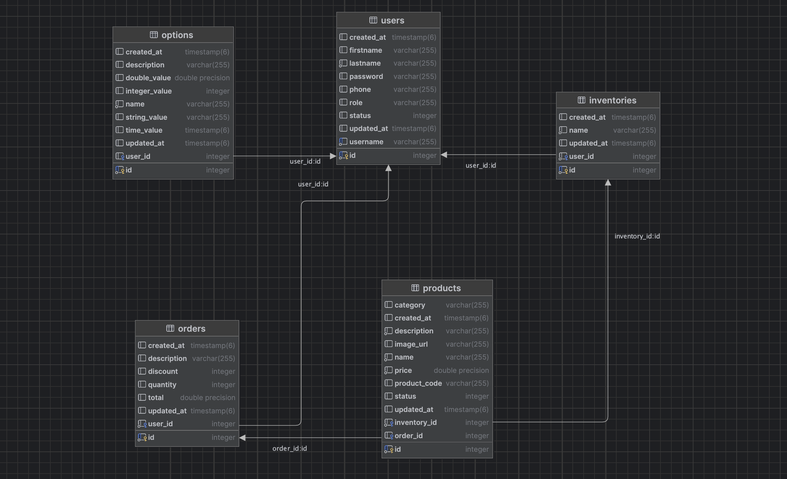

# Spring Boot: Ecommerce Inventory Project - REST API

This project demonstrates how to manages products from a shoes' ecommerce that allows ship orders and more.

## Overview

This project shows the interaction between users, inventories, products and orders. Even some promos are stored in a parametric table.

Technologies used:
- Spring Boot 3
- Spring Security 6
- jsonwebtoken

## Installation

Follow these steps to install and run the project:

1. Create a database named `ecommerce` in PostgreSQL
2. Clone the repository: `git clone https://github.com/faykris/ecommerce-tgs-back.git`
3. Navigate to the project directory: `cd your-repo`
4. Change your respective DB credentials in `application.properties` file
4. Build the project using Maven:: `mvn clean install`
5. Run the project: `mvn spring-boot:run`
6. Perform the database inserts specified below these instructions (Optional)
7. Test the API Rest using Postman or another application at `http://localhost:8080`

## Queries in database - fixed

The following queries are optional to execute. However you can add a bunch of record immediately as users, inventories, products and orders. 
The orders is necessary be created in website due to dependency with orderId in products table  

```SQL
-- The password for all of them is: password
INSERT INTO users(username, "password", firstname, lastname, phone, "role", status, created_at)
VALUES
    ('john_doe@gmail.com', '$2a$10$eh6w0yznfQRHrVYRB9OUy.bAqjpAhxLA/QJtIuZlFBI.YFhDyFoc2', 'John', 'Doe', '3123456781', 'ADMIN', 1, CURRENT_TIMESTAMP),
    ('jane_smith@gmail.com', '$2a$10$eh6w0yznfQRHrVYRB9OUy.bAqjpAhxLA/QJtIuZlFBI.YFhDyFoc2', 'Jane', 'Smith', '3123456782', 'USER', 1, CURRENT_TIMESTAMP),
    ('michael_brown@gmail.com', '$2a$10$eh6w0yznfQRHrVYRB9OUy.bAqjpAhxLA/QJtIuZlFBI.YFhDyFoc2', 'Michael', 'Brown', '3123456783', 'USER', 1, CURRENT_TIMESTAMP),
    ('emily_jones@gmail.com', '$2a$10$eh6w0yznfQRHrVYRB9OUy.bAqjpAhxLA/QJtIuZlFBI.YFhDyFoc2', 'Emily', 'Jones', '3123456784', 'ADMIN', 1, CURRENT_TIMESTAMP),
    ('william_taylor@gmail.com', '$2a$10$eh6w0yznfQRHrVYRB9OUy.bAqjpAhxLA/QJtIuZlFBI.YFhDyFoc2', 'William', 'Taylor', '3123456785', 'USER', 1, CURRENT_TIMESTAMP),
    ('olivia_johnson@gmail.com', '$2a$10$eh6w0yznfQRHrVYRB9OUy.bAqjpAhxLA/QJtIuZlFBI.YFhDyFoc2', 'Olivia', 'Johnson', '3123456786', 'USER', 1, CURRENT_TIMESTAMP),
    ('james_williams@gmail.com', '$2a$10$eh6w0yznfQRHrVYRB9OUy.bAqjpAhxLA/QJtIuZlFBI.YFhDyFoc2', 'James', 'Williams', '3123456787', 'ADMIN', 1, CURRENT_TIMESTAMP),
    ('sophia_davis@gmail.com', '$2a$10$eh6w0yznfQRHrVYRB9OUy.bAqjpAhxLA/QJtIuZlFBI.YFhDyFoc2', 'Sophia', 'Davis', '3123456788', 'USER', 1, CURRENT_TIMESTAMP),
    ('charles_miller@gmail.com', '$2a$10$eh6w0yznfQRHrVYRB9OUy.bAqjpAhxLA/QJtIuZlFBI.YFhDyFoc2', 'Charles', 'Miller', '3123456789', 'USER', 1, CURRENT_TIMESTAMP),
    ('isabella_anderson@gmail.com', '$2a$10$eh6w0yznfQRHrVYRB9OUy.bAqjpAhxLA/QJtIuZlFBI.YFhDyFoc2', 'Isabella', 'Anderson', '3123456710', 'USER', 1, CURRENT_TIMESTAMP);

INSERT INTO inventories(user_id, "name", created_at)
VALUES (1, 'Plaza Centro', CURRENT_TIMESTAMP),
       (2, 'Mega Plaza', CURRENT_TIMESTAMP),
       (3, 'Plaza Ensueño', CURRENT_TIMESTAMP),
       (4, 'Mall Centro', CURRENT_TIMESTAMP);

INSERT INTO products("name", description, price, category, inventory_id, product_code, created_at, image_url)
VALUES
    ('Lisa Profesional Golty', 'Zapatilla lisa adecuada para el césped', 337900, 'Deportivos', 1, 'b52b884d-81cd-4754-8511-d38abc241a21', CURRENT_TIMESTAMP, 'https://golty.com.co/wp-content/uploads/2023/05/zapatilla-lisa-profesional-top-speed-blanco1.jpg'),
    ('Lisa Profesional Golty', 'Zapatilla lisa adecuada para el césped', 337900, 'Deportivos', 1, 'b52b884d-81cd-4754-8511-d38abc241a21', CURRENT_TIMESTAMP, 'https://golty.com.co/wp-content/uploads/2023/05/zapatilla-lisa-profesional-top-speed-blanco1.jpg'),
    ('Lisa Profesional Golty', 'Zapatilla lisa adecuada para el césped', 337900, 'Deportivos', 1, 'b52b884d-81cd-4754-8511-d38abc241a21', CURRENT_TIMESTAMP, 'https://golty.com.co/wp-content/uploads/2023/05/zapatilla-lisa-profesional-top-speed-blanco1.jpg'),
    ('Lisa Profesional Golty', 'Zapatilla lisa adecuada para el césped', 337900, 'Deportivos', 1, 'b52b884d-81cd-4754-8511-d38abc241a21', CURRENT_TIMESTAMP, 'https://golty.com.co/wp-content/uploads/2023/05/zapatilla-lisa-profesional-top-speed-blanco1.jpg'),
    ('Lisa Profesional Golty', 'Zapatilla lisa adecuada para el césped', 337900, 'Deportivos', 1, 'b52b884d-81cd-4754-8511-d38abc241a21', CURRENT_TIMESTAMP, 'https://golty.com.co/wp-content/uploads/2023/05/zapatilla-lisa-profesional-top-speed-blanco1.jpg');

INSERT INTO products("name", description, price, category, inventory_id, product_code, created_at, image_url)
VALUES
    ('Zapatos para bádminton', 'Zapatillas de entrenamiento de malla transpirable, ideal para niños y adolescentes', 383900, 'Deportivos', 2, '39b04111-99b2-4890-ad01-05601e48d2f7', CURRENT_TIMESTAMP, 'https://ae01.alicdn.com/kf/Sf9e97649eacb41899761596cddd04d6a0/Zapatos-de-b-dminton-para-ni-os-y-adolescentes-zapatillas-de-entrenamiento-de-malla-transpirable-antideslizantes.jpg'),
    ('Zapatos para bádminton', 'Zapatillas de entrenamiento de malla transpirable, ideal para niños y adolescentes', 383900, 'Deportivos', 2, '39b04111-99b2-4890-ad01-05601e48d2f7', CURRENT_TIMESTAMP, 'https://ae01.alicdn.com/kf/Sf9e97649eacb41899761596cddd04d6a0/Zapatos-de-b-dminton-para-ni-os-y-adolescentes-zapatillas-de-entrenamiento-de-malla-transpirable-antideslizantes.jpg'),
    ('Zapatos para bádminton', 'Zapatillas de entrenamiento de malla transpirable, ideal para niños y adolescentes', 383900, 'Deportivos', 2, '39b04111-99b2-4890-ad01-05601e48d2f7', CURRENT_TIMESTAMP, 'https://ae01.alicdn.com/kf/Sf9e97649eacb41899761596cddd04d6a0/Zapatos-de-b-dminton-para-ni-os-y-adolescentes-zapatillas-de-entrenamiento-de-malla-transpirable-antideslizantes.jpg');

INSERT INTO products("name", description, price, category, inventory_id, product_code, created_at, image_url)
VALUES
    ('Zapatillas Showtheway', 'Estas zapatillas pueden con todo. Su silueta delgada con un logo de adidas en la lengueta', 375900, 'Casuales', 3, '4ac79574-9ae9-4323-8a3a-41122d7bd174', CURRENT_TIMESTAMP, 'https://assets.adidas.com/images/w_600,f_auto,q_auto/491fb5a326e64b11a9e4ab89012e06c7_9366/Zapatillas_Showtheway_Negro_FX3749_06_standard.jpg'),
    ('Zapatillas Showtheway', 'Estas zapatillas pueden con todo. Su silueta delgada con un logo de adidas en la lengueta', 375900, 'Casuales', 3, '4ac79574-9ae9-4323-8a3a-41122d7bd174', CURRENT_TIMESTAMP, 'https://assets.adidas.com/images/w_600,f_auto,q_auto/491fb5a326e64b11a9e4ab89012e06c7_9366/Zapatillas_Showtheway_Negro_FX3749_06_standard.jpg'),
    ('Zapatillas Showtheway', 'Estas zapatillas pueden con todo. Su silueta delgada con un logo de adidas en la lengueta', 375900, 'Casuales', 3, '4ac79574-9ae9-4323-8a3a-41122d7bd174', CURRENT_TIMESTAMP, 'https://assets.adidas.com/images/w_600,f_auto,q_auto/491fb5a326e64b11a9e4ab89012e06c7_9366/Zapatillas_Showtheway_Negro_FX3749_06_standard.jpg'),
    ('Zapatillas Showtheway', 'Estas zapatillas pueden con todo. Su silueta delgada con un logo de adidas en la lengueta', 375900, 'Casuales', 3, '4ac79574-9ae9-4323-8a3a-41122d7bd174', CURRENT_TIMESTAMP, 'https://assets.adidas.com/images/w_600,f_auto,q_auto/491fb5a326e64b11a9e4ab89012e06c7_9366/Zapatillas_Showtheway_Negro_FX3749_06_standard.jpg'),
    ('Zapatillas Showtheway', 'Estas zapatillas pueden con todo. Su silueta delgada con un logo de adidas en la lengueta', 375900, 'Casuales', 3, '4ac79574-9ae9-4323-8a3a-41122d7bd174', CURRENT_TIMESTAMP, 'https://assets.adidas.com/images/w_600,f_auto,q_auto/491fb5a326e64b11a9e4ab89012e06c7_9366/Zapatillas_Showtheway_Negro_FX3749_06_standard.jpg'),
    ('Zapatillas Showtheway', 'Estas zapatillas pueden con todo. Su silueta delgada con un logo de adidas en la lengueta', 375900, 'Casuales', 3, '4ac79574-9ae9-4323-8a3a-41122d7bd174', CURRENT_TIMESTAMP, 'https://assets.adidas.com/images/w_600,f_auto,q_auto/491fb5a326e64b11a9e4ab89012e06c7_9366/Zapatillas_Showtheway_Negro_FX3749_06_standard.jpg');


-- ORDERS MUST BE CREATED IN WEBSIDE PLATFORM 


INSERT INTO "options"(user_id, integer_value, time_value, created_at, "name", description)
VALUES
    (1, 10, '2024-10-09 00:59:39.838', CURRENT_TIMESTAMP, 'Oferta para órdenes', 'Se descontará el 10% en cada orden hasta que se cumpla la fecha especificada'),
    (1, 5, '2024-10-12 00:59:39.838', CURRENT_TIMESTAMP, 'Oferta para usuarios frecuentes', 'Se descontará el 5% a usuarios con 3 compras o más en menos de 1 mes');

```
